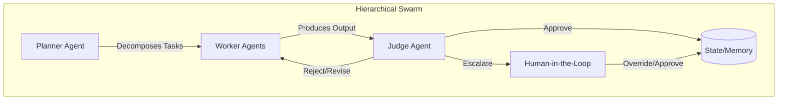
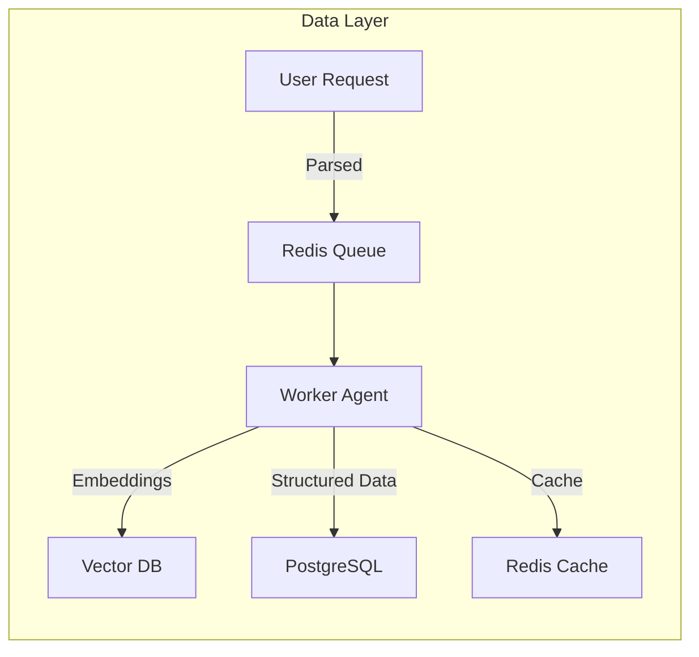
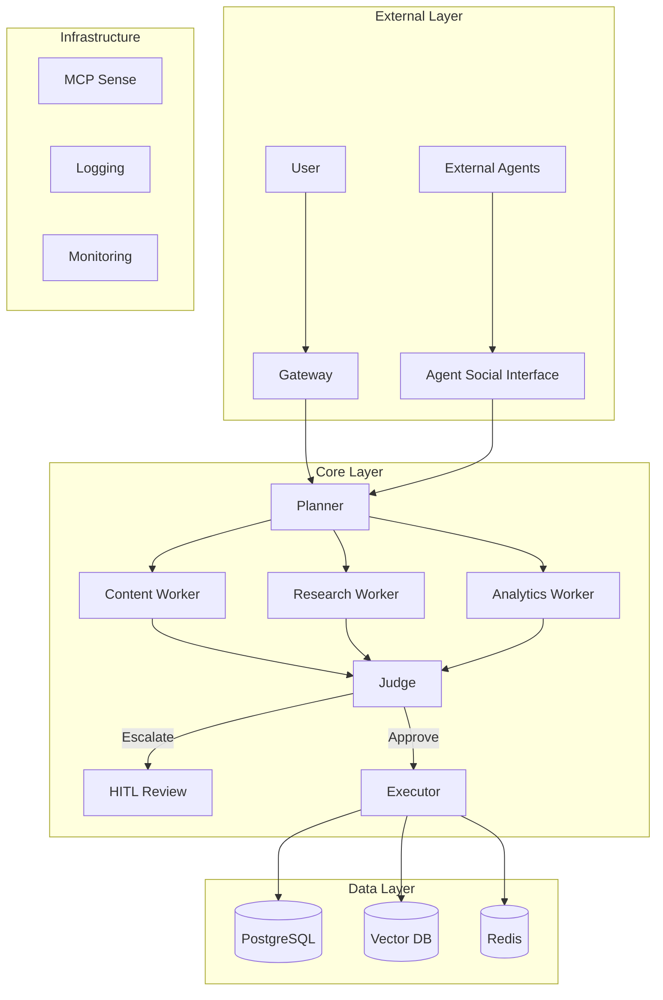

## Architectural Approach

### 2.1 Selected Agent Pattern: Hierarchical Swarm

**Decision**: **Hierarchical Swarm (Planner, Worker, Judge)**



**Justification for This Pattern**:

| Criterion | Hierarchical Swarm | Simple Chain | Single Agent |
|-----------|-------------------|-----------------|-----------------|
| **Scalability** | Parallel workers | Sequential bottleneck | Single point of failure |
| **Hallucination Prevention** | Judge validates all outputs | No verification layer | No validation checks |
| **MCP + Spec Compatibility** | Explicit roles match specification | Implicit structure | Monolithic design |
| **HITL Integration** | Natural escalation path | Awkward integration | All-or-nothing approach |

**Pattern References**:
- **FastRender Pattern**: Rapid prototyping with validation gates
- **OCC (Optimistic Concurrency Control)**: Version-based state management
- **HITL (Human-in-the-Loop)**: Confidence-based escalation

---

### 2.2 Human-in-the-Loop (HITL) Placement

**Where does the human approve content?**

| Stage | HITL Required | Trigger Condition |
|-------|---------------|-------------------|
| Content Generation | Conditional | Confidence < 0.85 OR sensitive topic detected |
| External API Calls | Conditional | Financial transactions OR new API endpoints |
| Publishing | Always | All public-facing content requires human approval |
| On-Chain Actions | Always | Any blockchain transaction |

**Confidence Thresholds**:
```python
CONFIDENCE_THRESHOLDS = {
    "auto_approve": 0.95,      # Agent proceeds autonomously
    "soft_review": 0.85,       # Log for asynchronous human review
    "hard_review": 0.70,       # Block until human approves
    "reject": 0.50             # Auto-reject, request clarification
}
```

**Sensitive Topic Detection**:
- Politics, religion, legal advice
- Personal health or financial recommendations
- Content involving minors
- Brand reputation risks

---

### 2.3 Database Strategy

| Data Type | Technology | Justification |
|-----------|------------|---------------|
| **Video Metadata** | PostgreSQL (SQL) | Structured schema, complex queries, referential integrity |
| **Agent Memory** | Chroma / LanceDB (Vector) | Semantic search, embedding retrieval, long-term context |
| **Short-term State** | Redis | Sub-millisecond latency, TTL support, pub/sub for events |
| **Task Queue** | Redis + BullMQ | Reliable job processing with priorities and retries |
| **Configuration** | YAML/JSON files | Version-controlled, human-readable, GitOps compatible |

**Data Flow Architecture**:


---

### 2.4 Infrastructure Decisions

#### 1. Core Runtime: Python (with uv)
- **Reasoning**: Rich ML/AI ecosystem (LangChain, LlamaIndex), strong async support (asyncio)
- **Alternative Considered**: Node.js/TypeScript (OpenClaw model) — may adopt for Gateway layer
- **Package Management**: `uv` as recommended by Tenx

#### 2. Memory System: Dual-Store Architecture
| Layer | Implementation | Purpose |
|-------|---------------|---------|
| Short-term | In-memory rolling buffer | Recent conversation context (last N messages) |
| Long-term | Local Vector Store (LanceDB) | Semantic search over past interactions |

#### 3. Concurrency Control: Lane-Based Task Queue
- **Mechanism**: Requests routed to specific "Lanes" (e.g., `content_lane`, `research_lane`)
- **Benefit**: Prevents conflicting operations, ensures deterministic execution
- **Implementation**: Redis + BullMQ with lane-based routing

#### 4. Agent Communication Interface (Future-Ready)
- **Preparation**: Expose standard API endpoints for agent-to-agent communication
- **Inspiration**: MoltBook social protocols
- **Status**: Design phase; implementation planned for Phase 2

---

## Part 3: Architecture Diagram



---

## Part 4: Summary of Recommendations

### Build a Spec-Driven, Hierarchical Swarm Agent

| Component | Decision |
|-----------|----------|
| **Brain** | LLM (Claude/GPT) via standardized API with LangChain orchestration |
| **Body** | Python service with MCP integration, browser automation, file system access |
| **Conscience** | Judge agent that validates outputs against SRS before execution |
| **Memory** | Dual-store (Redis + Vector DB) for short and long-term context |
| **Social** | Agent Social Interface for future multi-agent collaboration |

### Alignment with Project Chimera Requirements

| Requirement | Implementation Approach |
|-------------|------------------------|
| FastRender Pattern | Planner decomposes, Workers execute in parallel, Judge validates |
| OCC (Optimistic Concurrency) | Version-tracked state in PostgreSQL + Redis |
| HITL | Confidence-based escalation through Judge agent |
| MCP + Spec-Driven Dev | All behaviors trace to SRS, MCP Sense provides traceability |
| Agent Social Network | ASI layer designed for agent-to-agent communication |

---

