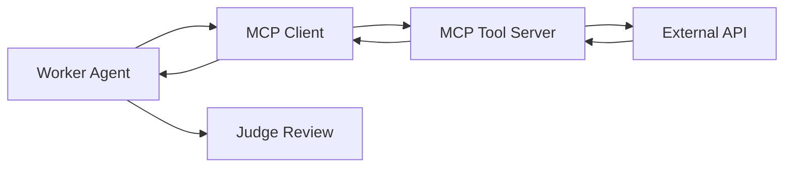

# Tooling Strategy & Skills Architecture

> **Context**: Distinction between Developer Tools (DevEx) and Agent Runtime Skills.
> **JSON Schema Reference**: [MCP Specification](https://modelcontextprotocol.io/specification)

---

## 1. Developer Tools (MCP)
*Tools that assist the Human Engineer (YOU) during development.*

| Tool Name | MCP Server | Purpose |
|-----------|------------|---------|
| **Filesystem** | `mcp-server-filesystem` | Allow IDE Agent to edit code and read specs. |
| **Git Automation** | `mcp-server-git` | Allow IDE Agent to commit changes and read history. |
| **Memory** | `mcp-server-memory` | Persistent context for the IDE Agent across sessions. |
| **SQLite Viewer** | `mcp-server-sqlite` | Inspect local database state during debugging. |

### 1.1 MCP Configuration Example

```json
{
  "mcpServers": {
    "filesystem": {
      "command": "npx",
      "args": ["-y", "@modelcontextprotocol/server-filesystem", "./project-chimera"],
      "env": {
        "READ_ONLY": "false"
      }
    },
    "memory": {
      "command": "npx",
      "args": ["-y", "@modelcontextprotocol/server-memory"],
      "env": {
        "PERSISTENCE_PATH": "./.mcp-memory"
      }
    }
  }
}
```

> **Configuration**: Located in IDE settings (e.g., `claude_desktop_config.json` or `cursor.json`).

---

## 2. Agent Skills (Runtime)
*Capabilities available to the Chimera Agent Swarm (Workers).*

### 2.1 Skill Categories

| Category | Description | Examples |
|----------|-------------|----------|
| **Perception** | "Seeing" the world | `fetch_trends`, `read_news_feed` |
| **Creation** | generating assets | `generate_image`, `generate_video` |
| **Action** | Changing state | `post_content`, `reply_comment` |
| **Commerce** | Financial transactions | `wallet_transfer`, `deploy_token` |

### 2.2 Integration Pattern



All skills are wrapped as **MCP Tools** exposed to the Agent Runtime:
- **Workers** call the tool via MCP Client
- **The Runtime** executes the Python function
- **The Function** calls the external API (Twitter, OpenAI, Coinbase)

---

## 3. Security Best Practices

| Practice | Implementation |
|----------|----------------|
| **Minimal Permissions** | MCP servers run with least-privilege access |
| **API Key Isolation** | Environment variables, never in code |
| **Rate Limiting** | Built-in backoff for all external calls |
| **Audit Logging** | All tool invocations logged with timestamps |
| **Sandboxing** | Containerized execution for untrusted operations |

---

## 4. Skill Definitions (Contracts)

### 4.1 Skill: Fetch Trends
* **Source**: `twitter`, `newsapi`
* **Output**: List of trending topics with relevance scores
* **Contract**: See `skills/skill_fetch_trends/README.md`

### 4.2 Skill: Generate Image
* **Model**: Midjourney / Ideogram
* **Constraint**: Must inject `character_reference_id`
* **Contract**: See `skills/skill_generate_image/README.md`

### 4.3 Skill: Post Content
* **Governance**: Requires valid `confidence_score`
* **Safety**: Checked by Judge before execution
* **Contract**: See `skills/skill_post_content/README.md`

---

## 5. Performance Monitoring

| Metric | Tool | Alert Threshold |
|--------|------|-----------------|
| **Tool Latency** | Prometheus | > 5s P95 |
| **Error Rate** | Grafana | > 5% per hour |
| **Queue Depth** | Redis Monitor | > 100 pending |
| **Cost per Call** | Budget Tracker | > $0.10 average |
