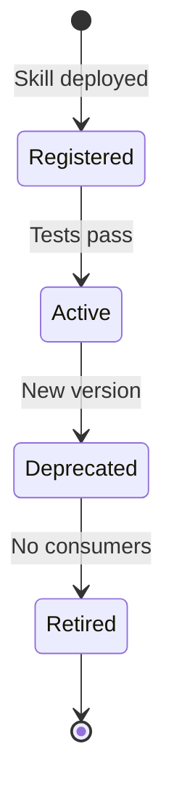

# Chimera Agent Skills Registry

This directory contains the operational skills (MCP Tools) available to the Chimera Agent Swarm.

---

## Skill Types

| Type | Purpose | Examples |
|------|---------|----------|
| **Perception** | Tools for reading data | `fetch_trends`, `read_news_feed` |
| **Creation** | Tools for generating assets | `generate_image`, `generate_video` |
| **Action** | Tools for modifying state | `post_content`, `reply_comment` |
| **Commerce** | Tools for financial transactions | `wallet_transfer`, `deploy_token` |

---

## Skill Lifecycle

1. **Registered**: Skill contract defined in README.md
2. **Active**: Integrated with MCP server and tested
3. **Deprecated**: Newer version available, migration window open
4. **Retired**: Removed from production

---

## Contract Structure

Each subdirectory contains a `README.md` defining:
- **Purpose**: What the skill does
- **MCP Tool Definition**: Server and tool name
- **Input Contract**: JSON Schema for parameters
- **Output Contract**: Expected response format
- **Error Handling**: Error codes and recovery strategies

---

## Error Handling Standards

| Error Code | Category | Action |
|------------|----------|--------|
| `E001` | Invalid Input | Return validation errors, do not retry |
| `E002` | Rate Limited | Exponential backoff, max 3 retries |
| `E003` | API Unavailable | Alert operator, queue for later |
| `E004` | Timeout | Retry once, then escalate |
| `E005` | Permission Denied | Log security event, block request |

---

## Testing Requirements

- **Unit Tests**: Each skill must have ≥80% coverage
- **Integration Tests**: Mock MCP server interactions
- **Contract Tests**: Validate input/output schemas
- **Load Tests**: Verify performance under concurrent calls
