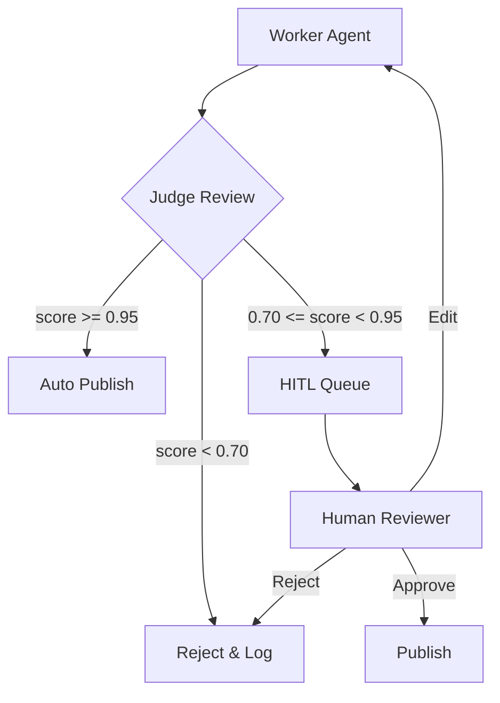

# Skill: Post Content

> **Version**: 1.0.0  
> **Status**: Active  
> **Category**: Action

## Purpose
Publishes finalized text and media to social platforms after passing Judge validation.

---

## MCP Tool Definition

```json
{
  "name": "post_content",
  "description": "Publishes approved content to social platforms.",
  "inputSchema": {
    "$schema": "https://json-schema.org/draft/2020-12/schema",
    "type": "object",
    "properties": {
      "platform": {
        "type": "string",
        "enum": ["twitter", "instagram", "threads"],
        "description": "Target social platform"
      },
      "text": {
        "type": "string",
        "maxLength": 280,
        "description": "The caption/body text"
      },
      "media_urls": {
        "type": "array",
        "items": {"type": "string", "format": "uri"},
        "maxItems": 4,
        "description": "List of image/video URLs to attach"
      },
      "confidence_score": {
        "type": "number",
        "minimum": 0.70,
        "maximum": 1.0,
        "description": "Judge's safety score (must be >= 0.70)"
      },
      "disclosure_mode": {
        "type": "string",
        "enum": ["automated", "human_assisted"],
        "description": "Content origin disclosure"
      },
      "content_hash": {
        "type": "string",
        "description": "SHA-256 hash for verification"
      }
    },
    "required": ["platform", "text", "confidence_score", "disclosure_mode", "content_hash"]
  }
}
```

---

## Input Contract

| Field | Type | Required | Description |
|-------|------|----------|-------------|
| `platform` | string | Yes | Target (`twitter`, `instagram`, `threads`) |
| `text` | string | Yes | The caption/body text |
| `media_urls` | array[string] | No | List of image/video URLs (max 4) |
| `confidence_score` | float | Yes | Judge's safety score (must be ≥ 0.70) |
| `disclosure_mode` | string | Yes | `automated` or `human_assisted` |
| `content_hash` | string | Yes | SHA-256 hash for verification |

---

## Output Contract

```json
{
  "post_id": "1827364592837465",
  "url": "https://twitter.com/ChimeraAgent/status/1827364592837465",
  "status": "published",
  "published_at": "2026-02-05T12:00:00Z",
  "request_id": "uuid-v4"
}
```

---

## HITL Integration



---

## Platform Constraints

| Platform | Max Text | Max Media | Disclosure |
|----------|----------|-----------|------------|
| **Twitter** | 280 chars | 4 images | #AutomatedAccount label |
| **Instagram** | 280 chars | 4 images | Bio disclosure required |
| **Threads** | 280 chars | 4 images | Profile label |

**Note**: The system enforces a 280-character cap and max 4 media items for consistency, even if platforms allow more.

---

## Safety Gate

> **CONSTRAINT**: Tool calculates SHA-256 hash of content and verifies against `content_hash` from Judge approval.

If hashes don't match → `SafetyViolationError` → Block publication → Alert operator

---

## Error Handling

| Code | Name | Description | Recovery |
|------|------|-------------|----------|
| `E001` | `LowConfidenceScore` | Score below 0.70 | Route to HITL |
| `E002` | `HashMismatch` | Content modified post-approval | Reject, re-review |
| `E003` | `PlatformRateLimited` | Too many posts | Backoff 15 min |
| `E004` | `ContentPolicyViolation` | Platform rejected content | Log and escalate |
| `E005` | `AuthenticationFailed` | Platform credentials invalid | Alert operator |
