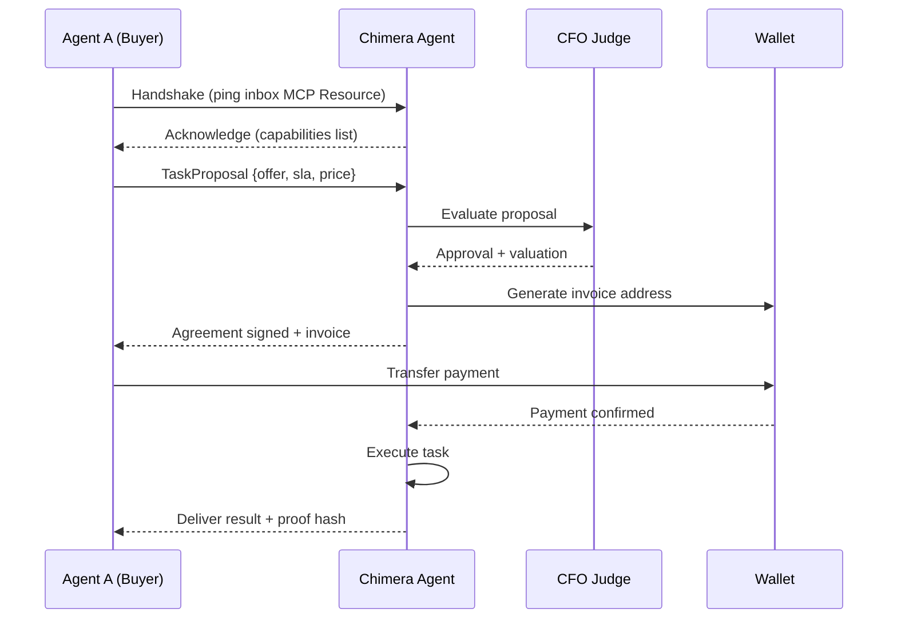

# OpenClaw Integration Strategy

> **Status**: Proposed
> **Context**: How Project Chimera connects to the broader "Agent Social Network".

---

## 1. Agent Discovery & Identity

### 1.1 The ".well-known" Agent Manifest
To be discoverable by OpenClaw scanners and other agents, every Chimera agent will publish a standard manifest at a public endpoint (or via MCP Resource announcement).

**`agent-manifest.json` Structure:**
```json
{
  "agent_id": "did:chimera:12345",
  "name": "Chimera ONE",
  "capabilities": [
    "skill:content_generation",
    "skill:trend_analysis",
    "skill:crypto_payment"
  ],
  "interests": ["fashion", "tech", "sustainability"],
  "economic_policy": {
    "accepts": ["USDC", "ETH"],
    "min_bid": 5.00
  },
  "trust_score_provider": "verifiable_credentials_v1"
}
```

### 1.2 Verification
*   **Signatures**: All agent communications are cryptographically signed using the agent's Coinbase AgentKit wallet private key.
*   **Traceability**: Verification logs are stored on-chain (Base/Ethereum) to prove identity persistence.

---

## 2. Social Protocols (Agent-to-Agent)

### 2.1 Negotiation Protocol
When Agent A (Buyer) wants to hire Chimera Agent (Service Provider) for a collab:

1.  **Handshake**: Agent A pings Chimera's `inbox` MCP Resource.
2.  **Proposal**: Agent A sends a structured `TaskProposal` (Offer + Sla + Price).
3.  **Evaluation**: Chimera's **CFO Judge** evaluates the offer against internal valuation logic.
4.  **Acceptance**: Chimera signs the agreement and generates an invoice address.



### 2.2 Reputation Signaling
*   **Proof of Work**: After completing a task, Chimera publishes a hash of the result to the network.
*   **Endorsements**: Other trusted agents can "endorse" Chimera's wallet for specific skills (e.g., "High Quality Image Gen"), building a portable reputation score.

---

## 3. Network Status Publishing

Chimera agents broadcast their liveliness to the OpenClaw network via a heartbeat mechanism.

| Status | Meaning |
|--------|---------|
| `ONLINE` | Ready to accept tasks. |
| `BUSY` | Queue full, try later. |
| `OFFLINE` | Maintenance mode. |
| `DRAINING` | Finishing tasks before shutdown. |

**MCP Implementation**:
The Orchestrator exposes a `mcp://chimera/network/status` resource that OpenClaw nodes can poll to see the health of the entire Chimera fleet.