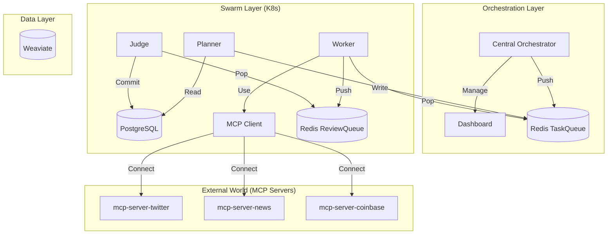

# Technical Specification — Project Chimera

> **Source**: SRS Section 6.2 (Data Models) & Section 2.3 (Infrastructure)

---

## 1. API Contracts

> **JSON Schema Reference**: All contracts follow [JSON Schema Draft 2020-12](https://json-schema.org/draft/2020-12/schema)

### 1.1 The Agent Task (JSON Schema)
*Payload passed from Planner to Worker via Redis `task_queue`.*

```json
{
  "$schema": "https://json-schema.org/draft/2020-12/schema",
  "type": "object",
  "properties": {
    "task_id": {"type": "string", "format": "uuid"},
    "task_type": {
      "type": "string",
      "enum": ["generate_content", "reply_comment", "execute_transaction"]
    },
    "priority": {"type": "string", "enum": ["high", "medium", "low"]},
    "context": {
      "type": "object",
      "properties": {
        "goal_description": {"type": "string"},
        "persona_constraints": {"type": "array", "items": {"type": "string"}},
        "required_resources": {"type": "array", "items": {"type": "string"}}
      },
      "required": ["goal_description"]
    },
    "assigned_worker_id": {"type": "string"},
    "created_at": {"type": "string", "format": "date-time"},
    "status": {
      "type": "string",
      "enum": ["pending", "in_progress", "review", "complete"]
    }
  },
  "required": ["task_id", "task_type", "priority", "context", "created_at", "status"]
}
```

### 1.2 HITL Confidence Thresholds

| Threshold | Range | Action |
|-----------|-------|--------|
| **Auto-Approve** | ≥ 0.95 | Direct publication, no review |
| **Soft Review** | 0.85 - 0.94 | Queued for batch review |
| **Hard Review** | 0.70 - 0.84 | Immediate reviewer notification |
| **Reject** | < 0.70 | Blocked, requires manual approval |

**Publishing Policy**: All public-facing content requires human approval before publishing, regardless of confidence score.

### 1.3 MCP Tool Definition
*Standard schema for Tools, e.g., `post_content`.*

```json
{
  "name": "post_content",
  "description": "Publishes approved content to social platforms.",
  "inputSchema": {
    "type": "object",
    "properties": {
      "platform": {
        "type": "string",
        "enum": ["twitter", "instagram", "threads"]
      },
      "text": {
        "type": "string",
        "maxLength": 280,
        "description": "The caption/body text"
      },
      "media_urls": {
        "type": "array",
        "items": {"type": "string", "format": "uri"},
        "maxItems": 4
      },
      "confidence_score": {
        "type": "number",
        "minimum": 0.70,
        "maximum": 1.0
      },
      "disclosure_mode": {
        "type": "string",
        "enum": ["automated", "human_assisted"]
      },
      "content_hash": {
        "type": "string",
        "description": "SHA-256 hash for verification"
      }
    },
    "required": [
      "platform",
      "text",
      "confidence_score",
      "disclosure_mode",
      "content_hash"
    ]
  }
}
```

---

## 2. Database Schema (ERD)

### 2.1 Entity: `Agents` (PostgreSQL)
*Identity and configuration.*
| Column | Type | Description |
|--------|------|-------------|
| `id` | UUID | Primary Key |
| `name` | VARCHAR | Agent Name |
| `soul_path` | VARCHAR | Path to SOUL.md |
| `wallet_address` | VARCHAR | Coinbase AgentKit Wallet |
| `status` | ENUM | ACTIVE, PAUSED, SLEEPING |
| `created_at` | TIMESTAMP | |

### 2.2 Entity: `Tasks` (PostgreSQL / Redis)
*Operational unit of work.*
| Column | Type | Description |
|--------|------|-------------|
| `id` | UUID | Primary Key |
| `agent_id` | UUID | FK to Agents |
| `type` | VARCHAR | e.g. "generate_content" |
| `priority` | INT | 1 (Low) - 10 (Critical) |
| `status` | ENUM | PENDING, REVIEW, DONE, FAILED |
| `result_payload` | JSONB | Output from Worker |
| `state_version` | BIGINT | OCC version for safe updates |
| `updated_at` | TIMESTAMP | Last update time |

### 2.3 Entity: `Memories` (Weaviate Vector DB)
*Semantic storage.*
| Class | Property | Type | Description |
|-------|----------|------|-------------|
| `Memory` | `content` | Text | The memory text |
| `Memory` | `agent_id` | Text | Filter by agent |
| `Memory` | `timestamp` | Date | When it happened |
| `Memory` | `vector` | Float[] | Embedding vector |

---

## 3. Infrastructure Topology

